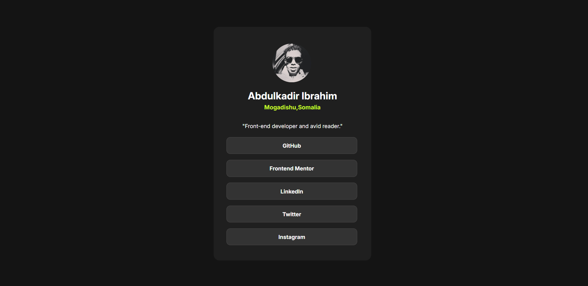
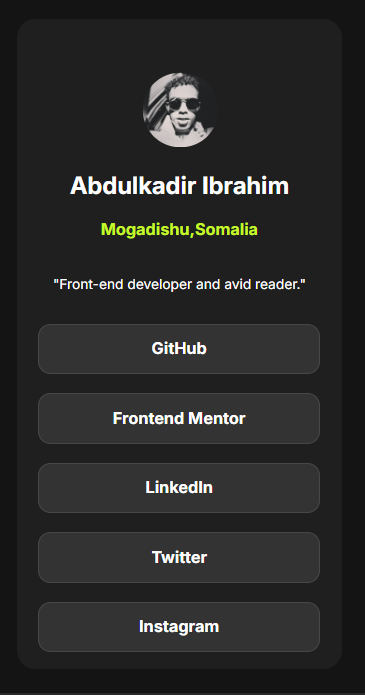

# Social links profile solution

This is a solution to the [Social links profile challenge on Frontend Mentor](https://www.frontendmentor.io/challenges/social-links-profile-UG32l9m6dQ). Frontend Mentor challenges help you improve your coding skills by building realistic projects. 

## Table of contents

- [Overview](#overview)
  - [The challenge](#the-challenge)
  - [Screenshot](#screenshot)
  - [Links](#links)
- [My process](#my-process)
  - [Built with](#built-with)
  - [What I learned](#what-i-learned)
  - [Continued development](#continued-development)
  - [Useful resources](#useful-resources)
- [Author](#author)
- [Acknowledgments](#acknowledgments)

## Overview
- This is a project that i have recently completed. The project is about building an Interactive & Responsive "Social links profile" using HTML & CSS. The links are fully functional with responsivess.

### The challenge

Users should be able to:

- See hover and focus states for all interactive elements on the page

### Screenshot

## Desktop design

## Mobile design

### Links

- Solution URL: [https://github.com/abdulkadir023/Social-Links](https://github.com/abdulkadir023/Social-Links)
- Live Site URL: [Add live site URL here](https://your-live-site-url.com)

## My process

- I used Visual studio code to write my code
- I also used some online resources to learn and build the project

### Built with

- Mobile-first workflow
- Semantic HTML5 markup
- CSS custom properties
- Flexbox

### What I learned

- Building responsive and interactive websites while adhering to different screen sizes like (Mobile, tablet, desktop etc).

## Author

- Frontend Mentor - [@abdulkadir023](https://www.frontendmentor.io/profile/abdulkadir023)
